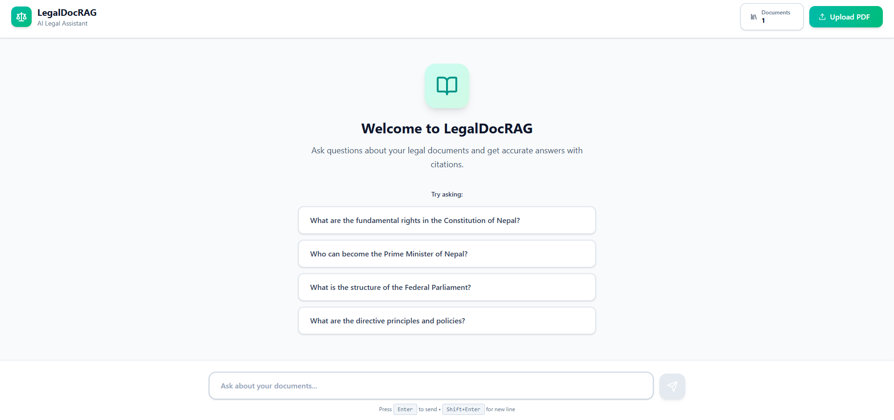
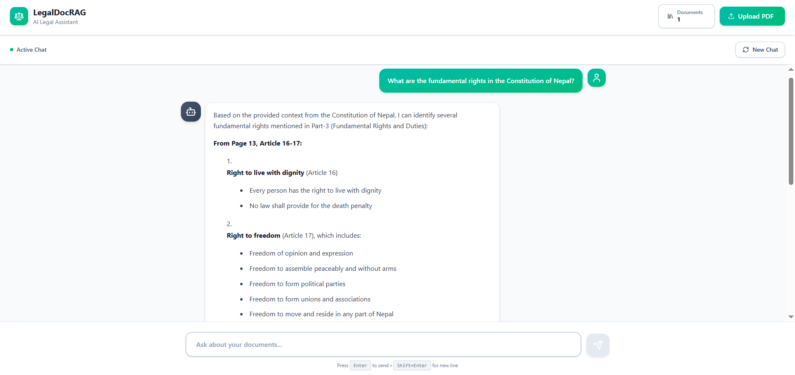

# Legal RAG Pipeline 🏛️⚖️

A **modular Retrieval-Augmented Generation (RAG) system** for legal document analysis, featuring hybrid retrieval, cross-encoder reranking, and LLM-based generation with quality assurance.

[](https://www.python.org/downloads/)
[](https://opensource.org/licenses/MIT)

---

## 📋 Table of Contents

- [Overview](#overview)
- [Screenshots](#screenshots)
- [Features](#features)
- [Project Structure](#project-structure)
- [Technology Stack](#technology-stack)
- [Getting Started](#getting-started)
- [Usage](#usage)

---

## 🎯 Overview

The Legal RAG Pipeline is designed to answer complex legal queries by:

1. **Preprocessing** queries with Named Entity Recognition (NER)
2. **Expanding** queries using a knowledge graph
3. **Retrieving** relevant documents using hybrid search (BM25 + FAISS)
4. **Reranking** results with cross-encoder models
5. **Generating** answers using fine-tuned LLMs
6. **Validating** responses for hallucinations and consistency

This system is particularly useful for:
- Legal research and case law analysis
- Contract review and interpretation
- Compliance checking
- Legal question answering systems

---

## 📸 Screenshots

### Initial Interface
The main chat interface ready to answer legal queries:



### Query Response
Example of the system answering a question about fundamental rights:



---

## ✨ Features

- 🔍 **Hybrid Retrieval**: Combines BM25 (sparse) and FAISS (dense) retrieval for optimal coverage
- 🧠 **Knowledge Graph Expansion**: Expands queries using legal domain knowledge
- 🎯 **Cross-Encoder Reranking**: Reranks retrieved documents for better relevance
- 🤖 **LoRA-tuned Generation**: Uses fine-tuned LLaMA models for legal text generation
- ✅ **Quality Assurance**: Built-in hallucination detection and consistency checking
- 📚 **Citation Tracking**: Automatic citation linking to source documents
- 🏗️ **Modular Architecture**: Easy to extend and customize individual components
- 💻 **Windows Compatible**: Works on Windows without bitsandbytes complications

---

## 📁 Project Structure

```
LegalDoc-RAG/
├── legaldocrag/                # Core RAG pipeline package
│   ├── __init__.py             # Package initialization
│   ├── pipeline.py             # Main orchestration pipeline
│   ├── preprocessing.py        # NER and entity extraction (spaCy)
│   ├── knowledge.py            # Knowledge graph query expansion
│   ├── retrieval.py            # Hybrid BM25 + FAISS retrieval
│   ├── reranker.py             # Cross-encoder reranking
│   ├── generator.py            # LLM-based answer generation
│   ├── corrective.py           # Hallucination detection & quality assurance
│   ├── citations.py            # Citation formatting utilities
│   └── config.py               # Pipeline configuration & settings
│
├── web/                        # Full-stack web application
│   ├── backend/                # FastAPI backend service
│   │   ├── app/                # Application code
│   │   │   ├── api/            # API routes and endpoints
│   │   │   ├── models/         # Pydantic schemas
│   │   │   ├── services/       # Business logic layer
│   │   │   ├── utils/          # Utility functions
│   │   │   ├── config.py       # Backend configuration
│   │   │   └── main.py         # FastAPI application entry
│   │   ├── legaldocrag/        # Core RAG modules for backend
│   │   ├── Dockerfile          # Backend container configuration
│   │   └── requirements.txt    # Backend Python dependencies
│   │
│   ├── frontend/               # React frontend application
│   │   ├── src/
│   │   │   ├── components/     # React components
│   │   │   │   ├── ChatInterface.jsx
│   │   │   │   ├── DocumentUpload.jsx
│   │   │   │   ├── DocumentListModal.jsx
│   │   │   │   ├── Header.jsx
│   │   │   │   ├── MessageBubble.jsx
│   │   │   │   └── SourceCitation.jsx
│   │   │   ├── services/       # API service layer
│   │   │   ├── App.jsx         # Main app component
│   │   │   ├── main.jsx        # React entry point
│   │   │   ├── index.css       # Global styles
│   │   │   └── animations.css  # Animation definitions
│   │   ├── public/             # Static assets
│   │   ├── Dockerfile          # Frontend container configuration
│   │   ├── package.json        # Node.js dependencies
│   │   ├── vite.config.js      # Vite build configuration
│   │   └── tailwind.config.js  # Tailwind CSS configuration
│   │
│   └── docker-compose.yml      # Multi-container orchestration
│
├── Model/                      # Original implementation
│   └── Model.py                # Original monolithic file (reference)
│
├── Screenshots/                # Application screenshots
│   ├── 1.png                   # Initial interface
│   └── 2.png                   # Query response example
│
├── docs/                       # Documentation and diagrams
│
├── run_pipeline.py             # Standalone pipeline entry point
├── requirements.txt            # Python dependencies
├── .gitignore                  # Git ignore rules
└── README.md                   # This file
```

**Note**: The `lora_adapters/` directory contains LoRA fine-tuned model weights and is excluded from version control due to large file sizes.

---

## 🛠️ Technology Stack

### Backend
- **Python 3.8+** - Core programming language
- **FastAPI** - Modern web framework for building APIs
- **LangChain** - Framework for LLM applications
- **FAISS** - Vector similarity search
- **BM25** - Sparse retrieval algorithm
- **spaCy** - NLP and entity recognition
- **Transformers** - HuggingFace models
- **LoRA** - Parameter-efficient fine-tuning

### Frontend
- **React 18** - UI library
- **Vite** - Build tool and dev server
- **Tailwind CSS** - Utility-first CSS framework
- **Axios** - HTTP client

### Infrastructure
- **Docker** - Containerization
- **Docker Compose** - Multi-container orchestration

---

## 🚀 Getting Started

### Prerequisites

- Python 3.8 or higher
- Node.js 16+ and npm
- Docker and Docker Compose (optional, for containerized deployment)

### Installation

#### Option 1: Local Development

**Backend Setup:**
```bash
# Install Python dependencies
pip install -r requirements.txt

# Navigate to backend directory
cd web/backend
pip install -r requirements.txt

# Run backend server
cd app
uvicorn main:app --reload
```

**Frontend Setup:**
```bash
# Navigate to frontend directory
cd web/frontend

# Install dependencies
npm install

# Run development server
npm run dev
```

#### Option 2: Docker Deployment

```bash
# Navigate to web directory
cd web

# Build and run with Docker Compose
docker-compose up --build
```

The application will be available at:
- Frontend: `http://localhost:5173`
- Backend API: `http://localhost:8000`
- API Documentation: `http://localhost:8000/docs`

---

## 💻 Usage

### Web Application

1. **Upload Documents**: Use the document upload interface to add legal documents to the knowledge base
2. **Ask Questions**: Type your legal query in the chat interface
3. **View Responses**: Get AI-generated answers with citations to source documents
4. **Review Sources**: Click on citations to see the referenced document sections

### Standalone Pipeline

Run the RAG pipeline directly:

```bash
python run_pipeline.py
```

This executes the complete pipeline:
1. Preprocessing and NER
2. Query expansion
3. Hybrid retrieval
4. Cross-encoder reranking
5. Answer generation
6. Quality validation

---

## 📝 API Endpoints

### POST `/api/chat`
Send a query and receive a response with citations

**Request:**
```json
{
  "message": "What are the fundamental rights?",
  "conversation_id": "optional-id"
}
```

**Response:**
```json
{
  "response": "Fundamental rights are...",
  "citations": [...],
  "conversation_id": "uuid"
}
```

### POST `/api/upload`
Upload legal documents for indexing

### GET `/api/documents`
List all uploaded documents

---

## 🤝 Contributing

Contributions are welcome! Please feel free to submit a Pull Request.

---

## 📄 License

This project is licensed under the MIT License.

---

## 👥 Authors

- **Shreya Uprety** - [@shreyaupretyy](https://github.com/shreyaupretyy)

---


